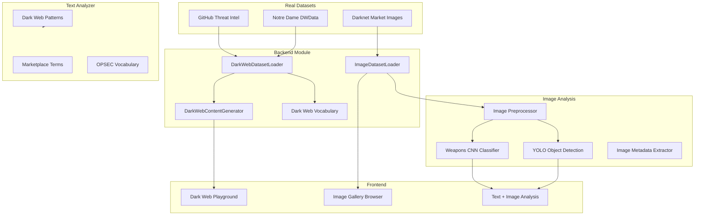

# Dark Web Module Integration Plan

## Overview

Integrate real dark web datasets from GitHub repositories into the weapons trade detection system, build a data processing framework, enhance the text analyzer with real dark web vocabulary, and create a comprehensive dark web playground UI.

## Selected Datasets

### Text Datasets

#### 1. Dark Web Threat Intelligence (GitHub)

- **Repository:** [https://github.com/nietowl/darkweb-threat-intel](https://github.com/nietowl/darkweb-threat-intel)
- **Content:** Forums, shops, chats, leaks in CSV format
- **Use:** Threat patterns, actor relationships, malware campaigns

#### 2. DWData (Notre Dame Research)

- **Repository:** [https://github.com/crcresearch/DWData](https://github.com/crcresearch/DWData)
- **Content:** Marketplace scrapes organized by date
- **Use:** Real listing patterns, vendor data, product categories

### Image Dataset

#### 3. Darknet Market Archives (2013-2015)

- **Source:** Academic Torrents
- **URL:** [https://academictorrents.com/details/1698989f23b60f91187d42b031f0ad857793888a](https://academictorrents.com/details/1698989f23b60f91187d42b031f0ad857793888a)
- **Content:** Raw HTML + product images from multiple darknet markets
- **Size:** Large archive with thousands of product listing images
- **Use:** Train image classifier for weapons/contraband detection

## Architecture




## Implementation Details

### Phase 1: Dataset Acquisition and Organization

**Storage Configuration:**

- **Images:** External folder at `/Users/oranbendavid/darkweb-datasets/`
- **Image Size Limit:** 15 GB maximum
- **Text Data:** Stays in project at `backend/collected_data/darkweb/`

**Directory Structure:**

```javascript
# TEXT DATA (in project - small, can be in git)
backend/collected_data/darkweb/
├── text/
│   ├── threat-intel/          # From nietowl/darkweb-threat-intel
│   │   ├── forums/
│   │   ├── shops/
│   │   ├── chats/
│   │   └── leaks/
│   └── dwdata/                # From crcresearch/DWData
│       └── [date-organized CSVs]
└── processed/                 # Normalized combined data
    ├── listings.json
    ├── forums.json
    ├── vocabulary.json
    └── image_metadata.json

# IMAGES (external folder - 15 GB limit)
/Users/oranbendavid/darkweb-datasets/
├── images/
│   ├── raw/                   # Original extracted images
│   │   ├── weapons/
│   │   ├── products/
│   │   └── misc/
│   ├── processed/             # Resized for ML (224x224)
│   ├── thumbnails/            # Small previews (150x150) for UI gallery
│   └── labeled/               # Categorized images
├── models/                    # Trained ML models
│   ├── weapons_cnn.pt
│   └── yolo_weapons.pt
└── cache/                     # Temporary processing files

**Image Serving Strategy (API + Thumbnails):**
- Thumbnails auto-generated at 150x150 px during import
- Gallery view loads thumbnails (fast, ~5-15 KB each)
- Click to load full-size via API
- Lazy loading for large galleries
- In-memory caching for frequently accessed images
```

**Storage Management:**

- Auto-cleanup when approaching 15 GB limit
- Priority: weapons images > other products > misc
- Compression for processed images
- Config file at `backend/config/darkweb_storage.json`

### Phase 2: Backend Components - Text Processing

**New Files to Create:**

- `[backend/src/darkweb/__init__.py](backend/src/darkweb/__init__.py)` - Module init
- `[backend/src/darkweb/dataset_loader.py](backend/src/darkweb/dataset_loader.py)` - Load and parse text datasets
- `[backend/src/darkweb/content_generator.py](backend/src/darkweb/content_generator.py)` - Generate dark web content
- `[backend/src/darkweb/vocabulary.py](backend/src/darkweb/vocabulary.py)` - Dark web vocabulary extractor

### Phase 3: Backend Components - Image Analysis

**New Files to Create:**

- `[backend/src/darkweb/image_loader.py](backend/src/darkweb/image_loader.py)` - Extract images from HTML archives
- `[backend/src/darkweb/image_analyzer.py](backend/src/darkweb/image_analyzer.py)` - CNN-based weapons image classifier
- `[backend/src/darkweb/image_preprocessor.py](backend/src/darkweb/image_preprocessor.py)` - Resize, normalize, augment images

**Image Analysis Capabilities:**

1. **Weapons Detection CNN** - Classify images as weapons/not-weapons
2. **Object Detection (YOLO)** - Detect specific weapon types in images
3. **Image Metadata Extraction** - EXIF data, file properties
4. **Similar Image Search** - Find related product images

**ML Dependencies to Add:**

```javascript
torch>=2.0.0
torchvision>=0.15.0
ultralytics>=8.0.0  # YOLO
Pillow>=10.0.0
opencv-python>=4.8.0
```

### Phase 4: Backend - API & Integration

**Files to Modify:**

- `[backend/src/detection/text_analyzer.py](backend/src/detection/text_analyzer.py)` - Add dark web patterns
- `[backend/src/server.py](backend/src/server.py)` - Add dark web + image API endpoints

### Phase 5: Frontend Components (TypeScript, matches existing UI/UX)

**Design System (must follow):**

- Dark gradients: `linear-gradient(135deg, rgba(0,30,60,0.8) 0%, rgba(0,15,30,0.9) 100%)`
- Accent colors: `#00ffff` (cyan), `#ff0080` (magenta), `#ff3366` (danger)
- Success: `#00ff88`, Warning: `#ffaa00`
- Fonts: Rajdhani (UI), Orbitron (numbers)
- Rounded corners: 12px cards, 8px buttons
- Emoji icons for visual elements

**New Files:**

- `[frontend/src/pages/DarkWebPage.tsx](frontend/src/pages/DarkWebPage.tsx)` - Main dark web page with tabs
- `[frontend/src/components/DarkWeb/DarkWebTextBrowser.tsx](frontend/src/components/DarkWeb/DarkWebTextBrowser.tsx)` - Browse text datasets
- `[frontend/src/components/DarkWeb/DarkWebImageGallery.tsx](frontend/src/components/DarkWeb/DarkWebImageGallery.tsx)` - Image gallery with thumbnails
- `[frontend/src/components/DarkWeb/DarkWebImageAnalyzer.tsx](frontend/src/components/DarkWeb/DarkWebImageAnalyzer.tsx)` - Upload & analyze images
- `[frontend/src/components/DarkWeb/DarkWebStats.tsx](frontend/src/components/DarkWeb/DarkWebStats.tsx)` - Dataset statistics

**Files to Modify:**

- `[frontend/src/components/Layout/Sidebar.tsx](frontend/src/components/Layout/Sidebar.tsx)` - Add Dark Web nav item
- `[frontend/src/App.tsx](frontend/src/App.tsx)` - Add `/darkweb` route

**New Navigation Item (in Sidebar.tsx):**

```typescript
{ path: '/darkweb', label: 'Dark Web Intel', icon: '🕸️', badge: darkwebStats.totalImages }
```

**Dark Web Page Layout:**

```
┌─────────────────────────────────────────────────────────────┐
│ 🕸️ DARK WEB INTELLIGENCE                                    │
│ Marketplace data from academic datasets • X items           │
├─────────────────────────────────────────────────────────────┤
│ [Stats Cards: Total Items | Text Posts | Images | Weapons]  │
├─────────────────────────────────────────────────────────────┤
│ [Tabs: 📝 Text Data | 🖼️ Images | 🔍 Analyze | ⚙️ Import]   │
├─────────────────────────────────────────────────────────────┤
│                                                             │
│  Tab Content (Gallery grid like MediaLibraryPage)           │
│  - Thumbnails with risk overlays                            │
│  - Filter by category, risk level                           │
│  - Click to open detail modal                               │
│                                                             │
└─────────────────────────────────────────────────────────────┘
```

**Image Gallery Features (like MediaLibraryPage):**

- Grid layout: `gridTemplateColumns: 'repeat(auto-fill, minmax(280px, 1fr))'`
- Thumbnail cards with hover effects
- Risk score overlay badge
- Weapons detection badge (red, pulsing)
- Click to open modal with full image + analysis
- Filters: Category, Risk Level, Sort
- Lazy loading for performance

## Dark Web Vocabulary Categories

Based on real marketplace data, the analyzer will detect:

1. **Marketplace Terms:** escrow, FE, verified vendor, trusted seller, dispute, refund policy
2. **OPSEC Terms:** PGP, encrypted, Tor, VPN, burner, dead drop, stealth shipping
3. **Crypto Payments:** BTC, XMR, Monero, Bitcoin, wallet address, tumbler
4. **Product Categories:** firearms, ammunition, explosives, tactical, suppressors
5. **Shipping Terms:** vacuum sealed, mylar, stealth, domestic, international, overnight
6. **Trust Indicators:** reviews, ratings, verified, escrow held, positive feedback

## API Endpoints

### Text Data Endpoints

```javascript
POST /api/darkweb/load-datasets     - Load text datasets from disk
GET  /api/darkweb/browse            - Browse loaded text data
GET  /api/darkweb/search            - Search across text datasets
POST /api/darkweb/generate          - Generate dark web style content
GET  /api/darkweb/vocabulary        - Get extracted vocabulary
GET  /api/darkweb/statistics        - Dataset statistics
```

### Image Analysis Endpoints

```javascript
POST /api/darkweb/images/upload     - Upload image for analysis
POST /api/darkweb/images/analyze    - Analyze image for weapons
GET  /api/darkweb/images/browse     - Browse image dataset
GET  /api/darkweb/images/search     - Search images by category
GET  /api/darkweb/images/{id}       - Get specific image + metadata
POST /api/darkweb/images/batch      - Batch analyze multiple images
GET  /api/darkweb/images/stats      - Image dataset statistics
```

### Combined Analysis Endpoints

```javascript
POST /api/darkweb/analyze-listing   - Analyze listing (text + images)
GET  /api/darkweb/threats           - Get high-risk listings (text + image)
```

## Image Classification Categories

The weapons image classifier will detect:

1. **Firearms:** Handguns, rifles, shotguns, automatic weapons

